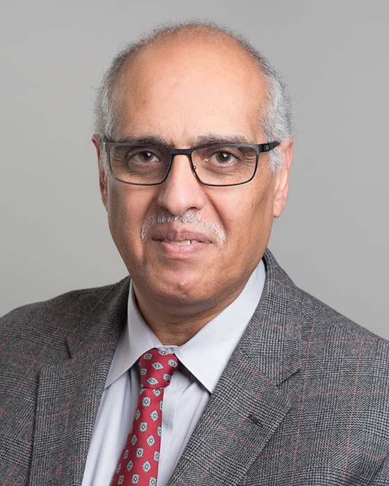

## Tarek Abdelrahman

Professor 
Department of Electrical and Computer Engineering 
University of Toronto

E-Mail: [tsa@eecg.toronto.edu](mailto:tsa@eecg.toronto.edu) 
Phone: (416) 978-4690 
Office: SF 2002C 
Website: [https://www.eecg.utoronto.ca/~tsa/](https://www.eecg.utoronto.ca/~tsa/) 

### Biography

Tarek Abdelrahman received his PhD degree in Computer Science and Engineering from the University of Michigan at Ann Arbor in 1989. His research interests are in the areas parallel systems, parallelizing and optimizing compilers, parallel programming models and associated support. He teaches courses in the area of computer software, including programming, compilers and operating systems. He served as ECE’s Associate Chair from January 2006 to December 2008, as Acting First-Year Chair in 2004, and as Director of the Computer Engineering undergraduate program from August 1998 to July 2001.

### Research Interests

Prof. Abdelrahman's research interests are the general area of parallel systems (e.g., multicores or GPUs) and their associated software, with an overall research goal of making these systems easy to use for application scientists and software developers.

### Honours and Awards

- Senior Member of the ACM
- Senior Member of the Institute of Electrical and Electronics Engineers (IEEE)
- Member of the IEEE Computer Society
- Member of the USENIX Computing Society
- Licensed member of the Professional Engineers of Ontario (PEO)
- General Chair, IEEE International Conference on Distributed Computing Systems, 2009
- Program Chair, IEEE International Conference on Distributed Computing Systems, 2007
- General Chair, International Conference on Parallel Processing, 2004
- Program Chair, International Conference on Parallel Processing, 2002
- Jeffery P. Skoll Chair in Software Engineering, 2002-2012
- Best Paper Award. Parallel and Distributed Computing and Systems, 2006
- Best Paper Award. Parallel and Distributed Computing and Systems, 2001
- Sustained Excellence in Teaching Award, Faculty of Applied Science and Engineering, 2013
- ECE Departmental Teaching Award, 2004, 2006, 2007, 2010, 2011
- Faculty Teaching Award, Faculty of Applied Science and Engineering, 2008
