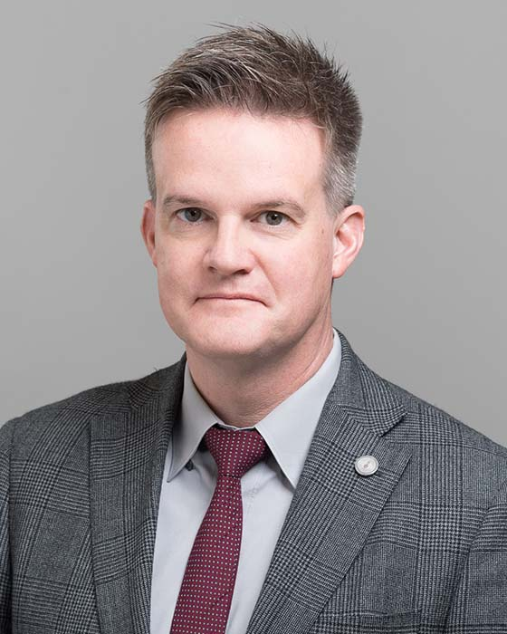

## Jason H. Anderson

Professor 
Department of Electrical and Computer Engineering 
University of Toronto

E-Mail: [janders@eecg.toronto.edu](mailto:janders@eecg.toronto.edu) 
Phone: (416) 946-7285 
Office: EA 314 
Website: [https://www.eecg.toronto.edu/~janders](https://www.eecg.toronto.edu/~janders)

### Biography

Jason H. Anderson received the BSc degree in Computer Engineering from the University of Manitoba, and the MASc and PhD degrees in Electrical & Computer Engineering (ECE) from the University of Toronto (U of T). In 1997, Dr. Anderson joined Xilinx, Inc. in San Jose, California working on computer-aided design (CAD) tools for integrated circuits. From 2005 to 2008, he managed groups at Xilinx focused on placement, routing and strategic research and development projects. He became a Principal Engineer at Xilinx in 2007. He joined the ECE Department at U of T in 2008. His research interests include all aspects of CAD, architecture, circuits and applications for field-programmable gate arrays (FPGAs). Dr. Anderson serves on the program committees of various international conferences, including the IEEE International Conference on Field-Programmable Technology (FPT), the ACM International Symposium on Field-Programmable Gate Arrays (FPGA), and the International Conference on Field-Programmable Logic and Applications (FPL). He served as General Chair of ACM FPGA 2018, Program Chair of ACM FPGA 2017, Program Co-Chair of FPL 2017, and Program Co-Chair of FPT 2012. He is Chief Scientific Advisor and Co-Founder of LegUp Computing Inc., a start-up spawned from his research in the ECE department.

### Research Interests

Prof. Anderson's research relates to computer hardware design, and specifically to programmable logic devices such as field-programmable gate arrays (FPGAs) and coarse-grained reconfigurable arrays (CGRAs).

### Honours and Awards

- Best Paper Award, IEEE International Conference on Field Programmable Logic, 2017
- Fellow of the Japanese Society for the Promotion of Science, 2014-2015
- Early Researcher Award, Ontario Ministry of Research and Innovation, 2014
- Best Paper Award, ACM International Symposium on Field-Programmable Gate Arrays, 2014
- ECE Departmental Teaching Award, 2014
- ECE Departmental Teaching Award, 2013
- Faculty of Applied Science & Engineering Early Career Teaching Award, 2013
- Gordon R. Slemon Award for Excellence in the Teaching of Design, 2012
- ECE Departmental Teaching Award, 2012
- Best Paper Award, IEEE International Conference on Field Programmable Logic, 2011
- ECE Departmental Teaching Award, 2011
- Best Paper Award, IEEE International Conference on Field Programmable Technology, 2010
- ECE Departmental Teaching Award, 2010
- ECE Departmental Teaching Award, 2009
- Xilinx Ross Freeman Award for Technical Innovation, 2000
- Licensed Professional Engineer (P.Eng.) in Ontario, since 2009
- Member of IEEE, ACM
