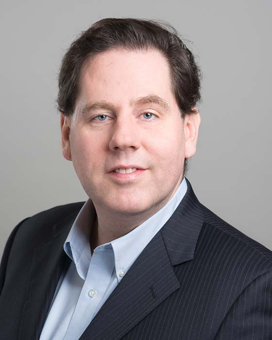

## Vaughn Betz

Professor 
Department of Electrical and Computer Engineering 
University of Toronto

E-Mail: [vaughn@eecg.toronto.edu](mailto:vaughn@eecg.toronto.edu) 
Phone: (416) 978-3007 
Office: EA 311 
Website: [https://www.eecg.toronto.edu/~vaughn/](https://www.eecg.toronto.edu/~vaughn/)

### Biography

Vaughn Betz received his BSc degree in electrical engineering from the University of Manitoba in 1991, his M.S. degree in electrical and computer engineering from the University of Illinois at Urbana–Champaign in 1993, and his PhD degree in electrical and computer engineering from the University of Toronto in 1998. His research focuses on creating efficient programmable hardware (FPGAs), computer-aided design (CAD) programs to optimize hardware systems, and hardware accelerators for compute-intensive applications, such as deep learning. He is the original developer of the widely used VPR FPGA placement, routing and architecture evaluation CAD flow, and a lead developer in the VTR project that has built upon VPR. He co-founded Right Track CAD to develop new FPGA CAD tools and architectures and joined Altera upon Right Track CAD’s acquisition. Dr. Betz spent 11 years at Altera (now part of Intel), ultimately as Senior Director of Software Engineering, and is one of the architects of the Quartus CAD system and the first five generations of the Stratix and Cyclone FPGA families. He holds 101 U.S. patents and has published over 100 technical articles in the FPGA area, thirteen of which have won best or most significant paper awards. Dr. Betz is a Fellow of the IEEE, the National Academy of Inventors and the Engineering Institute of Canada, and a Faculty Affiliate of the Vector Institute for Artificial Intelligence.

### Research Interests

- Architecture changes to make spatially programmable hardware (FPGAs) more efficient and easier to use. A major focus in this area is creating new FPGA architectures that are more efficient for deep learning inference, yet still highly programmable and general purpose enough to implement entire systems. Another focus is creating FPGAs that are more datacenter-friendly, allowing easier design and simpler use by multiple applications through techniques like embedding NoCs in the fabric.
- New Computer-Aided Design tools to make it easier to design hardware, and to investigate new FPGA architectures.
- Methods to map deep learning applications to direct hardware execution on programmable devices like FPGAs. By generating customized hardware for each layer in a neural network we can outperform prior approaches, and by changing the chips themselves in our FPGA architecture research we can improve efficiency even more.
- CAD tools to make FPGAs easier to debug and better suited to the data center; in particular we are seeking ways to let FPGA tasked be interrupted and safely context switched in and out of hardware in a data center.
- Hardware acceleration of important problems and software tools to optimize medical treatments; most recently I've focused on simulating photon scattering in complex human tissue to aid photodynamic cancer treatments. This is a form of light-activated chemotherapy which can better target tumours than conventional chemotherapy, but which requires advanced computation to determine where the fiber optic light probes should be placed (via hyperdermic needles) to achieve the best results.

### Honours and Awards

- Third Paper Award, IEEE International Conference on Microelectronics, 2021
- Best Paper Award, ACM TRETS, 2021
- ECE Departmental Teaching Award, 2021
- Google Faculty Research Award. 2020
- TC-FPGA Hall of Fame Paper, 2020
- Vassiliadis Best Paper Award, Field Programmable Logic and Applications Conference, 2018
- Early Career Teaching Award, 2017
- Best Paper Award, IEEE International Conference on Field-Programmable Technology, 2016
- Professional Engineers of Ontario Medal for Engineering Excellence, 2016
- Gordon R. Slemon Award for Excellence in the Teaching of Design, 2016
- Two 25-year significant paper awards, Field Programmable Logic and Applications Conference, 2015
- FPL Community Award, for contributions to FPGA Placement and Routing Research, 2015
- Best Paper Award, ACM International Symposium on Field-Programmable Gate Arrays, 2015
- IBM Faculty Award, 2014
- Best Paper Award, IEEE International Symposium on Field-Programmable Custom Computing Machines, 2014
- ECE Departmental Teaching Award, 2013
- Vassiliadis Best Paper Award, Field Programmable Logic and Applications Conference, 2013
- Six awards for papers in the FPGA 20: the twenty-five most significant publications in 20 years of the FPGA Symposium, 2012
- Governor General's Gold Medal for Best Graduate Student in Science, Engineering or Medicine, 1999
- Colton Medal for Research Excellence, 1999
- Fellow, Institute of Electrical and Electronics Engineers (IEEE)
- Fellow, National Academy of Inventors
- Fellow, Engineering Institute of Canada
- Member, Association for Computing Machinery (ACM)
- Faculty Affiliate, Vector Institute for Artificial Intelligence
- Member, Centre for Spatial Computational Learning
