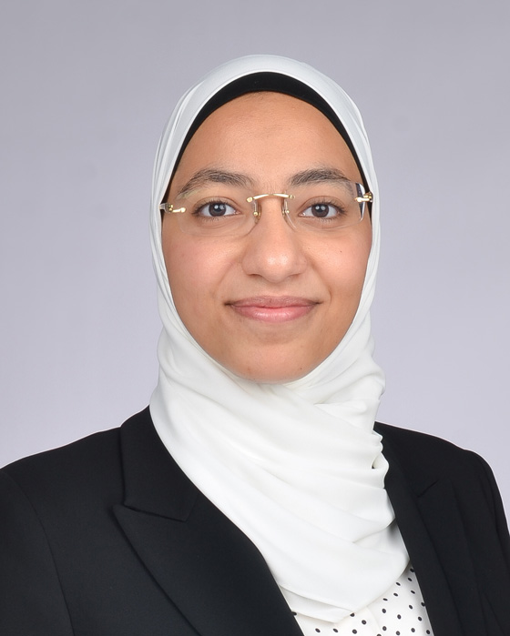

## Salma Emara

Assistant Professor, Teaching Stream 
Department of Electrical and Computer Engineering 
University of Toronto

E-Mail: [salma@ece.utoronto.ca](mailto:salma@ece.utoronto.ca) 
Phone: 416-978-1801 
Office: PT 374B 
Website: [https://www.eecg.utoronto.ca/~salma/](https://www.eecg.utoronto.ca/~salma/)

### Biography

Salma Emara received her BSc degree in Electronics and Communications Engineering from the American University in Cairo in 2018, and her PhD degree in Electrical and Computer Engineering from the University of Toronto in 2022. During her PhD, she received two departmental teaching awards: one as a course instructor and one as a teaching assistant for first- and second-year programming courses. Her research focuses on improving reinforcement learning algorithms to solve problems in computer networking algorithms. Currently, she is researching pedagogical practices to build debugging skills for beginner programmers. She believes that engineers learn by doing, which makes her committed to engaging students through in-class activities and problem-solving assignments and projects. She strives to create inclusive learning environments for all students from different backgrounds.

### Honours and Awards

- Departmental Teaching Award, ECE, University of Toronto, 2022–2024
- Departmental Teaching Assistant Award, ECE, University of Toronto, 2022
- Shortlisted for the university-wide Teaching Assistants’ Training Program (TATP) Teaching Assistant Teaching Excellence Award, University of Toronto, 2022
