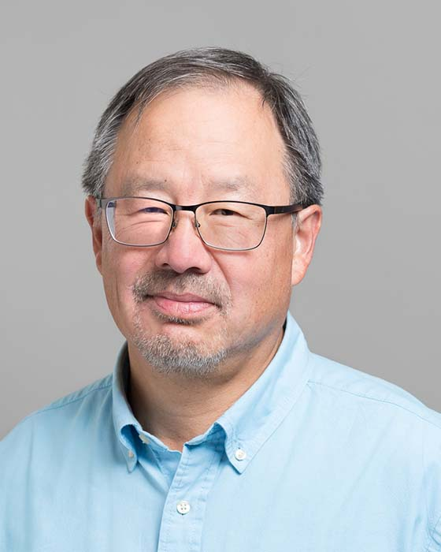

## Paul Chow

Professor Emeritus 
Department of Electrical and Computer Engineering 
University of Toronto

E-Mail: [pc@eecg.toronto.edu](mailto:pc@eecg.toronto.edu) 
Phone: (416) 978-2402 
Office: EA 320 
Website: [http://www.eecg.utoronto.ca/~pc/](http://www.eecg.utoronto.ca/~pc/)

### Biography

Paul Chow received the BASc degree with honours in Engineering Science, and the MASc and PhD degrees in Electrical Engineering from the University of Toronto, Toronto, Ont., in 1977, 1979 and 1984, respectively.  In 1984 he joined the Computer Systems Laboratory at Stanford University, Stanford, CA, as a Research Associate, where he was a major contributor to an early RISC microprocessor design called MIPS-X, one of the first microprocessors with an on-chip instruction cache. He joined the Department of Electrical and Computer Engineering at the University of Toronto in January 1988, where he is now a Professor and holds the Dusan and Anne Miklas Chair in Engineering Design. His research interests include high performance computer architectures, reconfigurable computing, heterogeneous cloud computing, embedded and application-specific processors, and field-programmable gate array architectures and applications.

### Research Interests

Prof. Chow's research interests centre around building things, mostly with FPGAs and VLSI technology.

### Membership and Awards

- Member of ACM, since 1987
- Fellow of the Institute of Electrical and Electronics Engineers (FIEEE) 2019
- Fellow of the Engineering Institute of Canada (FEIC)
