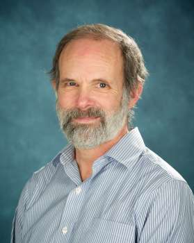

## Philip Anderson

Associate Professor, Teaching Stream Emeritus 
Department of Electrical and Computer Engineering 
University of Toronto

E-Mail: p.anderson@utoronto.ca 
Phone: (416) 978-6341 
Office: EA 316 
Website: [https://www.ece.utoronto.ca/people/anderson-p/](https://www.ece.utoronto.ca/people/anderson-p/)

### Biography

Philip Anderson received the BASc, MASc and PhD degrees in 1973, 1976 and 1981 respectively from the University of Toronto, Faculty of Engineering. He has been a professional engineer since 1980 through work done on automated test equipment at Computing Devices in Ottawa. For his doctorate, he worked in the areas of computer architecture and computer reliability. After this, he worked in the Toronto area on steel mill instrumentation as a consultant, and afterwards co-founded two companies that produced electro-mechanical automated instrumentation for sewer line inspection and other customized equipment with embedded processors. Notable projects included lens controllers for IMAX used in the shuttle, inspection equipment for the military, high power inspection devices, nuclear boiler tube inspection equipment, elevator controllers and security units. He joined the faculty in Electrical & Computer Engineering in 2000.  He continues his interests in design, computer architecture and general technology.

### Membership and Awards

- Member of IEEE, ACM, ASEE
- Professional Engineers Ontario
- Gordon R. Slemon award for the teaching of design (2006)
- Alan Blizzard Award for collaborative projects that improve student learning (2007)
