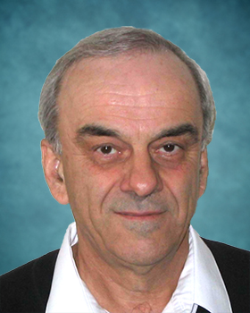

## Zvonko G. Vranesic

Professor Emeritus 
Department of Electrical and Computer Engineering 
University of Toronto

E-Mail: [zvonko@eecg.toronto.edu](mailto:zvonko@eecg.toronto.edu) 
Office:  
Phone: (416) 978-5032 
Website: [https://www.eecg.utoronto.ca/~zvonko/](https://www.eecg.utoronto.ca/~zvonko/)

### Biography

Zvonko Vranesic was born in Zagreb, Croatia. He received the B.A.Sc., M.A.Sc. and Ph.D. degrees in electrical engineering from the University of Toronto, Canada, in 1963, 1966 and 1968, respectively. From 1963 to 1965 he worked as a design engineer for Northern Electric Co. Ltd., Bramalea, Ontario, Canada. In 1968 he joined the faculty of the Departments of Electrical Engineering and Computer Science at the University of Toronto, where he is now a Professor Emeritus. During the academic years 1977/78 and 1984/85 he was a Senior Visitor in the Computer Laboratory at the University of Cambridge, England, and in the Institut de Programmation at the University of Paris 6, France.
At the University of Toronto, he served as the Director of the Computer Engineering Program from 1991 to 1995, and as Chair of the Division of Engineering Science from 1995 to 2000.

He was one of the co-founders of Microdesign Ltd. (in 1980); a high technology company which became a wholly owned R & D arm of the Meridian Technologies Co. in Toronto. He worked on numerous consulting projects in the area of computer engineering. Presently, he is a Principal Software Engineer at the Altera Toronto Technology Center.

His research interests include computer architecture and FPGA technology. He has co-authored five books and has published over 150 scientific papers. His books Computer "Organization" (co-authored by V.C. Hamacher and S.G. Zaky), "Fundamentals of Digital Logic with VHDL Design" (co-authored by S. Brown), and "Fundamentals of Digital Logic with Verilog Design" (co-authored by S. Brown) have become widely used (worldwide) in undergraduate courses on these subjects.

He represented Canada in numerous chess competitions. He holds the title of International Master.
