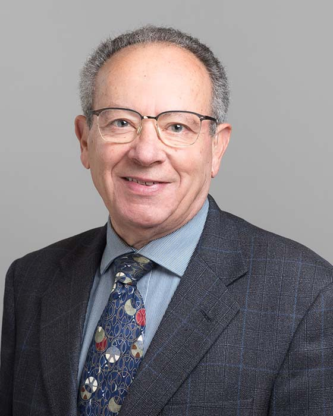

## Safwat G. Zaky

Professor Emeritus 
Department of Electrical and Computer Engineering 
University of Toronto

E-Mail: [safwat.zaky@utoronto.ca](mailto:safwat.zaky@utoronto.ca) 
Phone: 
Office: 
Website: [https://www.ece.utoronto.ca/people/zaky-s-g/](https://www.ece.utoronto.ca/people/zaky-s-g/)

### Biography

Safwat Zaky received his BSc degree in Electrical Engineering and BSc in Mathematics from Cairo University, Egypt, and his MASc and PhD degrees in Electrical Engineering from the University of Toronto. He joined the Department in 1973, after three years at Bell Northern Research, Bramalea, Ontario. He served as Department Chair from 1993 to 2003 and as Vice-Provost, Planning and Budget, from 2003 to 2009.  In 1980-81, he was a senior visitor at the Computer Laboratory, University of Cambridge, England. His research interests are in the areas of computer architecture, digital-circuit design, and electromagnetic compatibility. He is a coauthor of two books: Computer Organization and Embedded Systems, now in its sixth edition, and Microcomputer Structures.

### Memberships and Awards

- Member, Professional Engineers, Ontario
- Fellow, Canadian Academy of Engineering
- Life Senior Member, IEEE
- Recipient of the IEEE Third Millennium Medal and of the Vivek Goel Award for distinguished service to the University of Toronto
