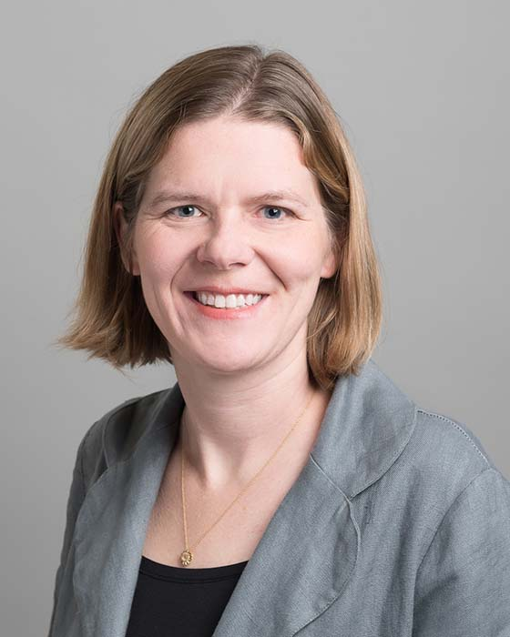

## Natalie Enright-Jerger

Professor 
Department of Electrical and Computer Engineering 
University of Toronto

E-Mail: [enright@ece.utoronto.ca](mailto:enright@ece.utoronto.ca) 
Phone: (416) 978-5056 
Office: EA 321 
Website: [https://www.eecg.toronto.edu/~enright](https://www.eecg.toronto.edu/~enright)

### Biography

Natalie Enright Jerger received the B.S. degree in Computer Engineering from Purdue University in 2002, and the M.S. and PhD degrees in Electrical Engineering from the University of Wisconsin-Madison in 2004 and 2008, respectively.  During her PhD studies she spent time at both Intel and IBM. She joined the ECE Department at the University of Toronto in 2009 as an Assistant Professor, promoted to Associate Professor in July 2014 and to Full Professor in 2017. Dr. Enright Jerger’s research interests are in the general area of computer architecture with an emphasis on interconnection networks, approximate computing, cache coherence protocols, memory hierarchies, and sustainable computing systems.  She has served as the program chair for the International Symposium on High Performance Computer Architecture (2014) and program co-chair of the International Conference on Architectural Support for Programming Languages and Operating Systems (2023). She is actively involved in improving diversity and inclusion within the computer architecture community.

### Research Interests

Multi- and many-core architectures, on-chip networks, cache coherence protocols, memory systems and approximate computing

### Honours and Awards

- Canada Research Chair in Computer Architecture
- Fellow of the Engineering Institute of Canada (2023)
- McLean Senior Fellow (2019)
- Percy Edward Hart Professor of Electrical and Computer Engineering (2016-2019)
- IEEE Micro Top Picks, 2016
- ACM/IEEE International Symposium on Microarchitecture Hall of Fame, 2015
- Borg Early Career Award, 2015
- Alfred P. Sloan Research Fellowship, 2015
- Ontario Professional Engineers Engineering Medal for Young Engineer, 2014
- Ontario Early Researcher Award Recipient, 2012
- IBM Ph.D. Fellowship Recipient, 2007 and 2008
- Fellow of the Institute of Electrical and Electronics Engineers (IEEE)
- Distinguished Scientist, Association for Computing Machinery (ACM)
