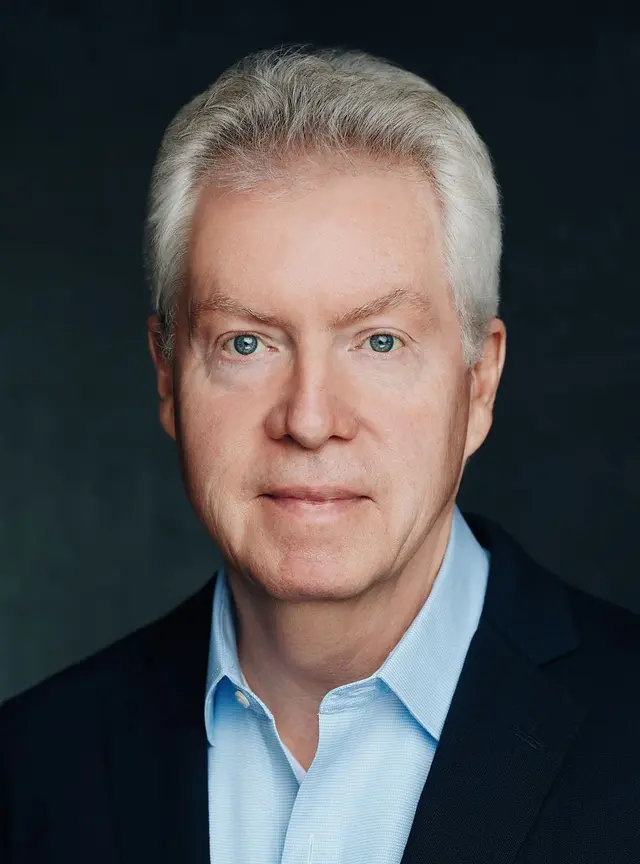

## Glenn Gulak

Professor 
Department of Electrical and Computer Engineering 
University of Toronto

E-Mail: [gulak@eecg.toronto.edu](mailto:gulak@eecg.toronto.edu) 
Phone: (416) 978-8671 
Office: BA 5140 
Website: [https://www.eecg.toronto.edu/~gulak](https://www.eecg.toronto.edu/~gulak)

### Biography

Dr. Glenn Gulak is a professor in the Department of Electrical & Computer Engineering at the University of Toronto. He is a Senior Member of the IEEE and a registered Professional Engineer in the province of Ontario. His present research interests are in the areas of algorithms, circuits, CMOS implementations of high-performance baseband digital communication systems and, additionally, in the area of CMOS biosensors. He has authored or co-authored more than 150 publications in refereed journals and refereed conference proceedings. He has received numerous teaching awards for undergraduate courses taught in both the Department of Computer Science and the Department of Electrical & Computer Engineering at the University of Toronto. From January 1985 to January 1988 he was a research associate in the Information Systems Laboratory and the Computer Systems Laboratory at Stanford University. He has served on the ISSCC Signal Processing Technical Subcommittee from 1990 to 1999, ISSCC Technical Vice-Chair in 2000 and served as the Technical Program Chair for ISSCC 2001. From March 2001 to March 2003 he was the Chief Technical Officer and Senior VP LSI Engineering of a fabless semiconductor startup headquartered in Irvine, Calif. He served on the Technology Directions Subcommittee for ISSCC from 2005 to 2008. He currently serves as the vice-president of the Publications Committee for the IEEE Solid-State Circuits Society.

### Research Interests

Dr. Gulak's present research interests are currently focused on two areas: (i) algorithms, circuits, and system-on-chip architectures for digital communication systems and (ii) for biological lab-on-chip microsystems.

### Honours and Awards

- Edward S. Rogers Sr. Chair in Electrical Engineering, 2005-2010
- Canada Research Chair in Signal Processing Systems (Tier 1), 2005-2012
- L. Lau Chair in Electrical and Computer Engineering, 1999-2004
- IEEE Millennium Medal, 2001
- Faculty of Applied Science and Engineering Teaching Award, 1999
