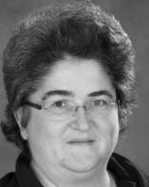

## Cristiana Amza

Professor 
Department of Electrical and Computer Engineering 
University of Toronto

E-Mail: amza@eecg.toronto.edu 
Phone:   
Office: BA 4142 
Website: [https://www.eecg.utoronto.ca/~amza/](https://www.eecg.utoronto.ca/~amza/)

### Biography

Prof. Cristiana Amza received the B.S. degree in Computer Engineering from Bucharest Polytechnic Institute in 1991, the M.S. and the Ph.D. degrees in Computer Science from Rice University in 1997 and 2003 respectively. Her research interests are in the design, implementation and evaluation of distributed systems. Her current work focuses on scaling and consistency issues in web server technologies and distributed databases.   Her current research project, Chorus on the Cloud studies infrastructure design for Cloud environments that can automatically adapt to a changing environment and workload through self-managing, self-tuning and self-healing. The project goal is to provide ease of use, scalability, high availability and differentiated quality-of-service for a range of dynamic content services such as e-commerce, on-line bidding, neuroscience modeling and massively multiplayer games.

In the past, she has worked on algorithms for data replication in persistent memory clusters, and reducing the overhead of consistency maintenance for Software Distributed Shared Memory systems.

It is with deep sadness that we announce [Professor Cristiana Amza's passing](https://www.engineering.utoronto.ca/wp-content/uploads/sites/28/2023/11/04a-Amza-Cristiana-MT.pdf) on September 8, 2023.

### Research Interests

Adaptive and reconfigurable distributed systems, distributed database systems, Web server technologies, parallel and distributed computing.

### Professional Activities

- International Conference on Distributed Computing Systems, ICDCS 2007 Vice-chair for the Autonomic Computing Track
- International Conference on Information and Knowledge Management (CIKM) 2006 Program Committee
- VLDB 2006 Program Committee, Infrastructure for Information Systems
- International Conference on Distributed Computing Systems, ICDCS 2006 Program Committee
- Middleware 2005 and 2006 Program Committee
- Workshop on Middleware for Grid Computing (MGC) 2006, 2005 and 2004 Program Committee
- DOA 2005 Program Committee
- IEEE International Conference on Data Engineering (ICDE 2005) Program Committee
- Middleware 2004 Program Committee and Publicity Chair

### Honours and Awards

- Best Paper Award, IBM CASCON International Conference, 2011
- Best Paper Award, ACM/IFIP Middleware Conference, 2008
- Ontario Early Research Award, 2007
