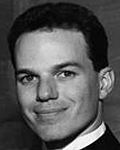

## Gregory Steffan

Associate Professor & Jeffrey Skoll Chair in Software Engineering 
Department of Electrical and Computer Engineering 
University of Toronto

E-Mail: steffan@eecg.toronto.edu 
Phone:   
Office: EA 321 
Website: [https://www.eecg.toronto.edu/~steffan](https://www.eecg.toronto.edu/~steffan)

### Biography

Greg Steffan is an Associate Professor in the Computer Engineering group at the University of Toronto. His research focus is on making multicore processors and FPGAs easier to program. Originally from Toronto, he received his B.A.Sc. and M.A.Sc. in Computer Engineering from the University of Toronto in 1995 and 1997 respectively. Greg was a Ph.D. student in the Computer Science Department at Carnegie Mellon University (Pittsburgh). There he was a member of the STAMPede project led by Todd Mowry which explored an aggressive combination of compiler technology and processor architecture to automatically parallelize general-purpose programs. He has worked in the architecture group of MIPS Technologies Inc. and in the ALPHA development group of Compaq Computer Corporation. He is a recipient of the Ontario Ministry of Research and Innovation Early Researcher Award (2007), a Siebel Scholar (2002), an IBM CAS Faculty Fellow and Visiting Scientist, and a senior member of both the IEEE and ACM. Greg plays classical guitar, enjoys golf and ball hockey (goalie), and likes to describe himself in the third person.

It is with deep sadness that we announce [Professor Greg Steffan's passing](https://www.engineering.utoronto.ca/wp-content/uploads/sites/28/2015/02/steffan.pdf) on July 24, 2014.

### Research Interests

Computer Architecture, Compilers, Reconfigurable Computing, Distributed and Parallel Systems.

### Honours and Awards

- Doctoral Dissertation Award, School of Computer Science, Carnegie Mellon University, 2003
