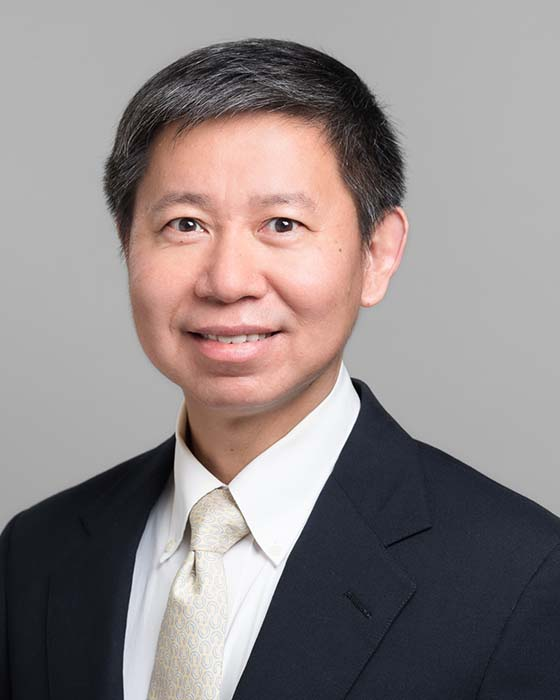

## Baochun Li

Professor 
Department of Electrical and Computer Engineering 
University of Toronto

E-Mail: bli@ece.toronto.edu 
Phone: (416) 946-7338 
Office: BA 4118 
Website: [https://iqua.ece.toronto.edu/bli](https://iqua.ece.toronto.edu/bli/) 

### Biography

Baochun Li received his B.Engr. degree from the Department of Computer Science and Technology, Tsinghua University, China, in 1995 and his M.S. and Ph.D. degrees from the Department of Computer Science, University of Illinois at Urbana-Champaign, Urbana, in 1997 and 2000. Since 2000, he has been with the Department of Electrical and Computer Engineering at the University of Toronto, where he is currently a Professor. He holds the Bell Canada Endowed Chair in Computer Engineering since August 2005. His current research interests include cloud computing, security and privacy, distributed machine learning, federated learning, and networking.

Dr. Li has co-authored more than 470 research papers, with a total of over 26000 citations, an H-index of 88 and an i10-index of 341, according to Google Scholar Citations. He was the recipient of the IEEE Communications Society Leonard G. Abraham Award in the Field of Communications Systems in 2000, the Multimedia Communications Best Paper Award from the IEEE Communications Society in 2009, the University of Toronto McLean Award in 2009, the Best Paper Award from IEEE INFOCOM in 2023, and the IEEE INFOCOM Achievement Award in 2024. He is a Fellow of the Canadian Academy of Engineering, a Fellow of the Engineering Institute of Canada, and a Fellow of IEEE.

### Research Interests

Cloud computing, security and privacy, distributed machine learning, federated learning, and networking

### Honours and Awards

- [IEEE INFOCOM Achievement Award](https://infocom2024.ieee-infocom.org/awards), the highest honour that can be bestowed on a researcher in the IEEE INFOCOM community, May 2024
- Fellow, Engineering Institute of Canada, December 2023
- Fellow, Canadian Academy of Engineering, June 2023
- Best Paper Award, IEEE INFOCOM 2023, IEEE Communications Society
  - for the paper co-authored with Fei Wang and Ethan Hugh, titled “More than Enough is Too Much: Adaptive Defenses against Gradient Leakage in Production Federated Learning,” May 2023
- Best Paper Award, IEEE International Conference on Metaverse Computing, Networking and Applications (IEEE MetaCom 2023)
  - for the paper co-authored with Ningxin Su and Bo Li, titled “Multi-Server Stable Rendezvous for the Metaverse,” June 2023
- Finalist for Best Paper Award, 2022 IEEE Conference on Computer Vision and Pattern Recognition (CVPR 2022)
  - for the paper co-authored with Wanyu Lin, Hao Lan, and Hao Wang, titled “OrphicX: A Causality-Inspired Latent Variable Model for Interpreting Graph Neural Networks,” June 2022
- Best Paper Candidate, IEEE International Conference on Cloud Engineering (IC2E 2016)
  - for the paper co-authored with Li Chen and Bo Li, titled “Barrier-Aware Max-Min Fair Bandwidth Sharing and Path Selection in Datacenter Networks,” April 2016
- IEEE Fellow, class of 2015, for contributions to application-layer network protocols and network coding
- Finalist for Best Paper Award, 10th USENIX International Conference on Autonomic Computing (ICAC 2013)
  - for the paper co-authored with Wei Wang and Ben Liang, titled “To Reserve or Not to Reserve: Optimal Online Multi-Instance Acquisition in IaaS Clouds,” June 2013
- Best Paper Award, IEEE Globecom 2011, Wireless Networking Symposium, IEEE Communications Society, 2011
- Multimedia Communications Best Paper Award, the Multimedia Communications Technical Committee, IEEE Communications Society, 2009
- Distinguished Educator Award, Department of Computer Science, University of Illinois at Urbana-Champaign, 2011
- NSERC Discovery Accelerator Supplements Award, 2011
- Departmental Teaching Award, ECE, University of Toronto, 2010
- McLean Award, University of Toronto, 2009
- The University of Toronto TechKnowFile Award, 2007
- ECE Departmental Service Award, 2006
- Best Student Paper Award, the Thirteenth International Workshop on Quality of Service (IWQoS), 2005
- Bell Canada Endowed Chair in Computer Engineering, 2005
- Nortel Networks Junior Chair in Network Architecture and Services, 2003
- Leonard G. Abraham Prize Paper Award in the Field of Communications Systems, IEEE Communications Society, 2000
- Outstanding Teaching Assistant Award, Computer Science, University of Illinois at Urbana-Champaign, 1999
