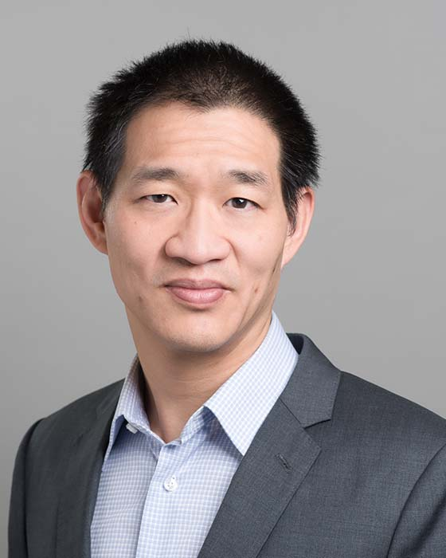

## David Lie

Professor 
Department of Electrical and Computer Engineering 
University of Toronto

E-Mail: [lie@eecg.toronto.edu](mailto:lie@eecg.toronto.edu) 
Phone: (416) 946-0251 
Office: SF 2001C 
Website: [https://www.eecg.toronto.edu/~lie/index.shtml](https://www.eecg.toronto.edu/~lie/index.shtml)

### Biography

David Lie received his BASc from the University of Toronto in 1998, and his MS and PhD from Stanford University in 2001 and 2004 respectively. He is currently a Professor in the Department of Electrical and Computer Engineering at the University of Toronto. He is known for his seminal work on the XOM architecture, which was an early precursor to modern trusted execution processor architectures such as ARM Trustzone and Intel SGX.  He was the recipient of a best paper award at SOSP for this work. David is also a recipient of the MRI Early Researcher Award, Connaught Global Challenge Award and previous holder of a Canada Research Chair. He developed the PScout Android Permission mapping tool, whose datasets have been downloaded over 10,000 times and used in dozens of subsequent papers. David has served on various  program committees including OSDI, Usenix Security, IEEE Security & Privacy, NDSS and CCS. Currently, his interests are focused on securing mobile platforms, cloud computing security and bridging the divide between technology and policy.

### Research Interests

Prof. Lie's research goal is to make computer systems more secure and trustworthy.

### Honours and Awards

- Best Paper Award, SOSP 2003
- CFI New Opportunities Fund, 2005
- MRI Early Research Award, 2008
- Member of the IEEE, ACM and USENIX
