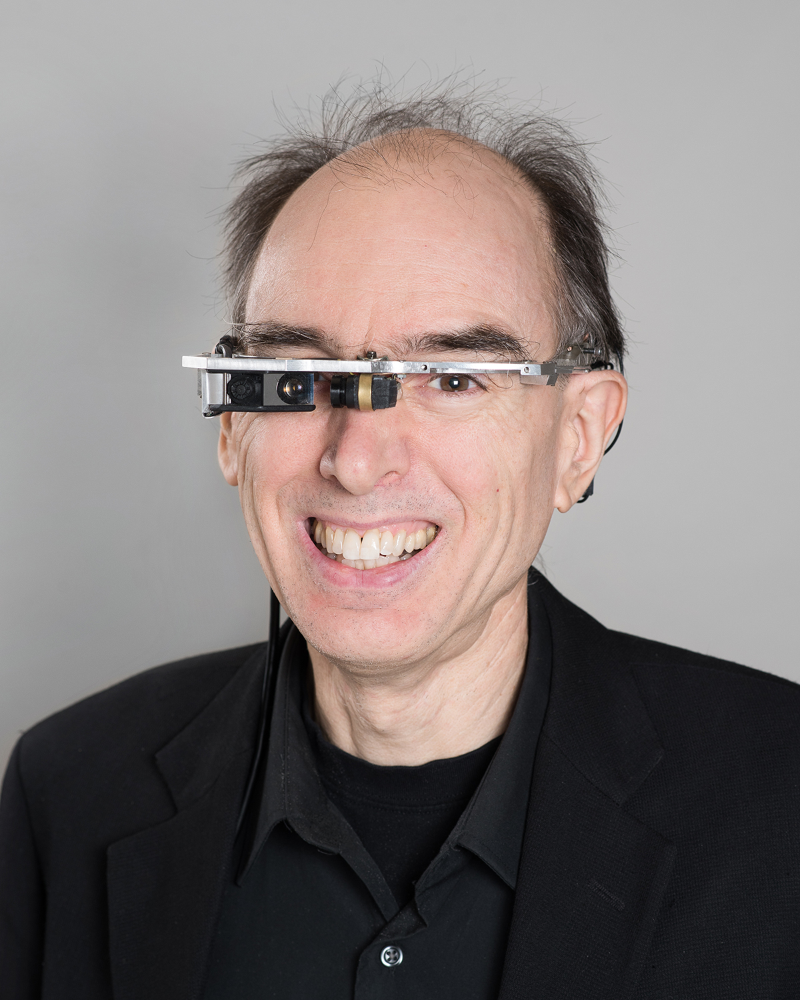

## Steve Mann

Professor 
Department of Electrical and Computer Engineering 
University of Toronto

E-Mail: [mann@eecg.toronto.edu](mailto:mann@eecg.toronto.edu) 
Phone: (416) 946-3387 
Office: SF 2002D 
Website: [https://www.eecg.utoronto.ca/~mann](https://www.eecg.utoronto.ca/~mann)

### Biography

Steve Mann has been recognized as “the father of wearable computing” (IEEE ISSCC 2000) and “the father of wearable augmented reality (AR)” for his invention of “Digital Eye Glass” (EyeTap) and mediated reality (predecessor of AR). He also invented the Chirplet Transform, Comparametric Equations, and HDR (High Dynamic Range) imaging (U.S. Pat. 5828793). He received his PhD from MIT in 1997, and is a tenured full professor at the University of Toronto.

Together with Marvin Minsky, “the father of AI (Artificial Intelligence)”, and Ray Kurzweil, Mann created the new discipline of HI (Humanistic Intelligence). Mann and his students co-founded numerous companies with a worth in excess of $1 billion. He also created the world’s first course on “inventrepreneurship” (invention and entrepreneurship).

Mann is also the inventor of the hydraulophone, the world’s first musical instrument to make sound from vibrations in liquids, giving rise to a new theory of reverse kinematics and mechanics based on the time-integral of displacement, for which Mann coined the term “absement”.

Mann has authored more than 200 publications, books and patents, and his work and inventions have been shown at the Smithsonian Institute, National Museum of American History, The Science Museum, MoMA, Stedelijk Museum (Amsterdam), and Triennale di Milano.

He has been featured in AP News, New York Times, Los Angeles Times, Time, Newsweek, Fortune, WiReD, NBC, ABC, CNN, David Letterman, CBC-TV, CBS, Scientific American, Scientific American Frontiers, Discovery Channel, Byte, Reuters, New Scientist, Rolling Stone, and BBC.

### Research Interests

Wearable Computing, Mediated Reality, Natural User Interfaces, Fluid User Interfaces, and Intelligent Image Processing

### Honours and Awards

- Fellow, IEEE
- Founding member of IEEE Council on Extended Intelligence, [https://globalcxi.org/](https://globalcxi.org/)
- General Chair of the IEEE ISTAS 2013 conference
- First place in the Coram International Sustainable Design Award for his interactive water feature
- Recipient of the 2004 Leonardo Award for Excellence
