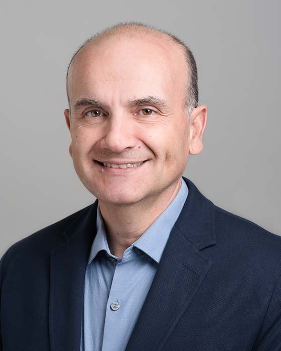

## Andreas Moshovos

Professor 
Department of Electrical and Computer Engineering 
University of Toronto

E-Mail: [moshovos@eecg.toronto.edu](mailto:moshovos@eecg.toronto.edu) 
Phone: (416) 946-7373 
Office: EA 310 
Website: [https://www.eecg.utoronto.ca/~moshovos/](https://www.eecg.utoronto.ca/~moshovos/)

### Biography

Andreas Moshovos along with his students has been answering the question “what is the best possible digital computation structure to solve problem X or to run application Y?” where “best” is a characteristic (or combination thereof) such as power, cost, complexity, etc. Much of his work has been on high-performance processor and memory system design and it has influenced commercial designs. Andreas Moshovos has received the Ptyhio and a Master’s in Computer Science from the University of Crete in 1990 and 1992 and the PhD degree in Computer Sciences from the University of Wisconsin-Madison in 1998. He has taught Computer Design at Northwestern University, USA, (Assistant Professor 1998-2000), the Ecole Polytechnique de Laussane, Switzerland, (Invited Professor 2011) and since 2000 at the Electrical and Computer Engineering Department of the University of Toronto where he now is a professor. Andreas Moshovos has served as the Program Chair for the ACM/IEEE International Symposium on Microarchitecture in 2011  and on numerous technical program committees in the area of Computer Architecture. He is an Associate Editor for the IEEE Computer Architecture Letters and the Elsevier Journal on Parallel and Distributed Computing.

### Research Interests

Prof. Moshovos' research interests lie primarily in the design of performance-, energy-, and/or cost-optimized computing engines for various applications domains.

### Honours and Awards

- ACM SIGARCH Maurice-Wilkes Award, 2010
- IEEE MICRO Top Picks in Computer Micro-Architecture Research, 2010
- IBM Faculty Partnership Award, 2008
- IBM Faculty Partnership Award, 2009
- IEEE MICRO Top Picks in Computer Micro-Architecture Research, 2006
- Inventor Recognition Award, Semiconductor Research Corporation (SRC), 2003
- Canada Foundation For Innovation, New Opportunities, 2002
- National Science Foundation (NSF) Faculty Early Career Development Award (CAREER), 2000
- Senior Member, Association for Computer Machinery (ACM)
- Senior Member, Institute of Electrical and Electronic Engineers (IEEE)
- Limited Engineering Licensee, Professional Engineers of Ontario
