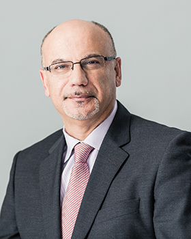

## Farid Najm

Professor 
Department of Electrical and Computer Engineering 
University of Toronto

E-Mail: [f.najm@utoronto.ca](mailto:f.najm@utoronto.ca 
Phone: (416) 946-5175 
Office: PT 484F 
Website: [https://www.eecg.utoronto.ca/~najm](https://www.eecg.utoronto.ca/~najm)

### Biography

Farid N. Najm received the B.E. degree (with distinction) in Electrical Engineering from the American University of Beirut (AUB) in 1983, and the M.S. and PhD degrees in Electrical and Computer Engineering from the University of Illinois at Urbana-Champaign (UIUC) in 1986 and 1989, respectively. He worked with Texas Instruments in Dallas, Texas, 1989-1992, then joined the ECE Department at UIUC as an Assistant Professor, becoming Associate Professor in 1997. In 1999, he joined the ECE Department at the University of Toronto, where he is now Professor and was Chair of the ECE Department from 2009-2019. Dr. Najm’s research interests are in the general area of computer-aided design (CAD) for integrated circuits, with an emphasis on circuit level issues related to power dissipation, timing, and reliability. Dr. Najm is a Fellow of the Canadian Academy of Engineering (CAE) and a Fellow of the IEEE.

### Research Interests

Dr. Najm's research interests are in the general area of computer-aided design (CAD) for integrated circuits, with an emphasis on circuit level issues related to power dissipation, timing, and reliability.

### Honours and Awards

- Best Paper Award, IEEE/ACM International Conference on Computer-Aided Design (ICCAD), 2020
- Safwat Zaky Research Leader Award, Faculty of Applied Science and Engineering, University of Toronto, 2020
- Best Paper Award, IEEE/ACM International Conference on Computer-Aided Design (ICCAD), 2019
- Best Paper Award, IEEE/ACM International Conference on Computer-Aided Design (ICCAD), 2016
- Prolific Author Award, IEEE/ACM Design Automation Conference (DAC), 2013
- Fellow of the Canadian Academy of Engineering (CAE), since 2010
- Distinguished Alumnus Award, Faculty of Engineering and Architecture, American University of Beirut (AUB), 2007
- Inventor Recognition Award, Semiconductor Research Corporation (SRC), 2003 and 2005
- Fellow of the Institute of Electrical and Electronics Engineers (IEEE), since 2003
- Outstanding Teaching Award, ECE Department, University of Illinois at Urbana-Champaign (USA), 1999
- NSF CAREER Award, National Science Foundation (USA), 1996
- NSF Research Initiation Award, National Science Foundation (USA), 1993
- Best Paper Award, IEEE Transactions on Computer-Aided Design, 1992
