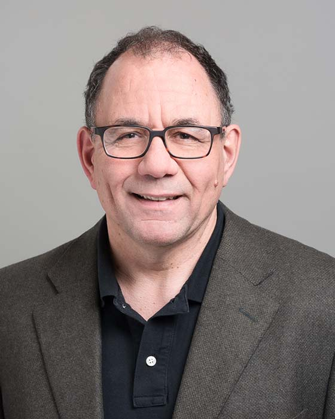

## Jonathan Rose

Professor 
Department of Electrical and Computer Engineering 
University of Toronto

E-Mail: [Jonathan.Rose@ece.utoronto.ca](mailto:Jonathan.Rose@ece.utoronto.ca) 
Phone: (416) 978-6992 
Office: EA 319 
Website: [https://www.eecg.utoronto.ca/~jayar/](https://www.eecg.utoronto.ca/~jayar/)

### Biography

Jonathan Rose is a Professor in the Edward S. Rogers Sr. Department of Electrical and Computer Engineering at the University of Toronto.

He received the PhD degree in Electrical Engineering in 1986 from the University of Toronto. From 1986 to 1989, he was a Post-Doctoral Scholar and then Research Associate in the Computer Systems Laboratory at Stanford University. In 1989, he joined the faculty of the University of Toronto. He spent the 1995-1996 year as a Senior Research Scientist at Xilinx, in San Jose, CA, working on the Virtex FPGA architecture. From 1989 until 1999 he was an NSERC University Research Fellow.

In October 1998, he co-founded Right Track CAD Corporation, which delivered architecture for FPGAs and Packing, Placement and Routing software for FPGAs to FPGA device vendors. He was President and CEO of Right Track until May 1, 2000. Right Track was purchased by Altera, and became part of the Altera Toronto Technology Centre, where Rose was Senior Director until April 30, 2003. His group at Altera Toronto shared responsibility for the development of the architecture for the Altera Stratix, Stratix II, Stratix GX and Cyclone FPGAs. His group was also responsible for placement, routing, delay annotation software and benchmarking for these devices, and for the placement and routing software for the Altera Apex 20K and Flex 10K FPGAs. From May 1, 2003 to April 30, 2004 Rose held the part-time position of Senior Research Scientist at Altera Toronto. He has worked for Bell-Northern Research and a number of FPGA companies on a consulting basis.

He served as Chair of the Edward S. Rogers Sr. Department of Electrical and Computer Engineering from January 2004 through June 2009, and as the Director of the Engineering Business Minor from 2010-2017. He currently serves at the Chair of the Advisory Board of the Engineering Entrepreneurship Hatchery at the University. He is a member of the Board of Directors for Academics without Borders, and a member of the Governing Board of Massey College in the University of Toronto.

He is the co-founder of the ACM FPGA Symposium. A paper co-authored with Steve Brown won a distinguished paper award at the 1990 ICCAD Conference. A paper co-authored with Alex Rodionov was awarded as the Best Paper of the ACM TRETS journal for 2016.  He serves on the technical advisory boards of Tactual Labs and Achronix.

His research has previously dealt with all aspects of FPGAs including their architecture, Computer-Aided Design (CAD), Field-Programmable Systems, and Soft Processors. His more recent research efforts have been in the area of the Automation of Medicine, with a focus on mental health. Please see the personal web page above for more detail on his research program.

### Research Interests

The applied goal of Prof. Rose's research is to find ways to help in mental health measurement, diagnosis and therapy, using Natural Language Processing, software and algorithms, with cloud-based systems to help automate these tasks.

### Honours and Awards

- University of Toronto Engineering Alumni Hall of Distinction Award, 2017
- Best Paper Award, ACM TRETs, 2016
- University of Toronto President's Teaching Award, 2016
- Ontario Confederation of University Faculty Associations Award, 2016
- Medal of Distinction in Engineering Education, Engineers Canada, 2015
- Faculty of Applied Science & Engineering Sustained Excellence in Teaching Award, 2015
- Fellow of the Royal Society of Canada, 2012
- Faculty of Applied Science & Engineering Faculty Teaching Award, 2012
- Foreign Member of the American National Academy of Engineering, 2011
- Fellow of the IEEE, 2009
- Fellow of the Canadian Academy of Engineering, 2009
- Fellow of the ACM, 2008
- Senior Fellow of Massey College, 2008
- Professional Engineer in the Province of Ontario, 2004
- University of Toronto Faculty Award, 2014
- NSERC University Research Fellow, 1989-1998
- Best Paper Award, ICCAD, 1990
