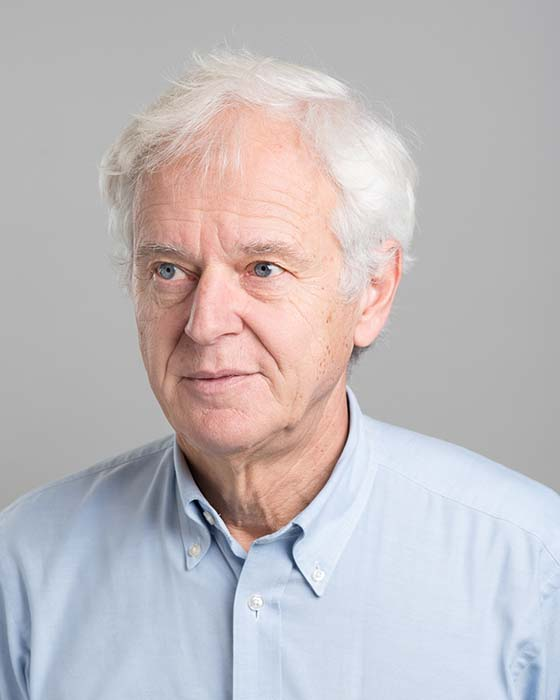

## Michael Stumm

Professor 
Department of Electrical and Computer Engineering 
University of Toronto

E-Mail: [stumm@eecg.toronto.edu](mailto:stumm@eecg.toronto.edu) 
Phone: (416) 978-3226 
Office: SF 2002B 
Website: [https://www.eecg.toronto.edu/~stumm/](https://www.eecg.toronto.edu/~stumm/)

### Biography

Michael Stumm received his undergraduate degree in Mathematics (dipl. math.)  and a PhD in Computer Science from the University of Zurich, Zurich Switzerland in 1980 and 1984, respectively. From 1984 to 1987 he was a researcher at IBM Research and a Post-Doc at Stanford University’s Computer Science Department. He joined the ECE Department of the University of Toronto as an Assistant Professor in 1987, becoming Associate Professor in 1993 and Professor in 1995. Dr. Stumm’s research interests are in the general area of computer systems software with an emphasis on operating systems for distributed systems and multiprocessors. While professor, Stumm co-founded two companies, SOMA Networks, and OANDA, a currency trading company. He ran OANDA from 2001 until 2012.

### Research Interests

Prof. Stumm's research interests lie in the general area of computer systems with a focus on systems software, the layer of software between hardware and applications.

### Memberships and Awards

- ACM (Member)
- IEEE (Member)
