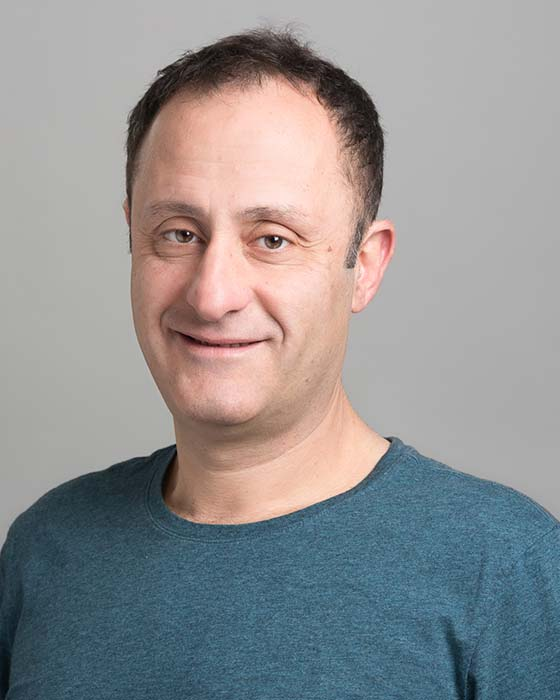

## Andreas Veneris

Professor 
Department of Electrical and Computer Engineering 
University of Toronto

E-Mail: [veneris@eecg.utoronto.ca](mailto:veneris@eecg.utoronto.ca) 
Phone: (416) 946-3062 
Office: SF 2001A 
Website: [https://www.eecg.utoronto.ca/~veneris/AndreasVeneris.htm](https://www.eecg.utoronto.ca/~veneris/AndreasVeneris.htm)

### Biography

Andreas Veneris received a Diploma in Computer Engineering and Informatics from the University of Patras in 1991, the M.S. degree in Computer Science from the University of Southern California, Los Angeles in 1992 and the Ph.D. degree in Computer Science from the University of Illinois at Urbana-Champaign in 1998. In 1998-99 he was a visiting faculty at the University of Illinois until he joined the Department of Electrical and Computer Engineering at the University of Toronto in 1999. Since 2011, he is a Professor cross-appointed with The Edward S. Rogers Sr. Department of Electrical & Computer Engineering and the Department of Computer Science at the University of  Toronto. His research interests include formal methods and CAD tools for debug, verification, synthesis and test of digital systems and circuits. In 2011 he was a fellow of the Japanese Society for the Promotion of Science hosted by the University of Tokyo.

### Research Interests

Prof. Veneris' research interests include game-theoretical incentives for crypto-economics, mechanism/system design of distributed ledger (blockchain or Web 3.0) systems, formal methods, Central Bank Digital Currencies, decentralized finance (DeFi), techno-legal questions for distributed ledger technology, and data analytics for fintech.

### Memberships and Awards

- ACM
- IEEE
- AAAS
- Professionals Engineers of Ontario
- Technical Chamber of Greece
- Planetary Society
- Best Paper Award IEEE/ACM Asian-South Pacific Design Automation Conference 2001
- Best Paper Nomination IEEE/ACM Design and Test in Europe 2007
- Best Paper Nomination IEEE/ACM Asian-South Pacific Design Automation Conference 2010
