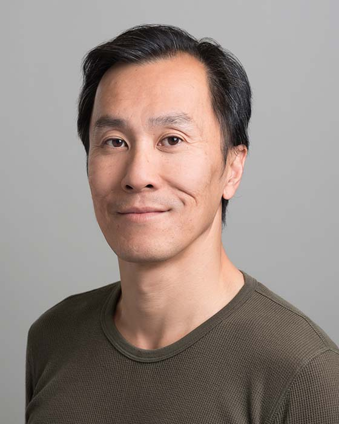

## Willy Wong

Professor 
Department of Electrical and Computer Engineering 
University of Toronto

E-Mail: [willy.wong@utoronto.ca](mailto:willy.wong@utoronto.ca) 
Phone: (416) 978-8734 
Office: BA 7110 
Website: [http://individual.utoronto.ca/willy/](http://individual.utoronto.ca/willy/)

### Biography

Willy Wong received his BSc in physics from the University of Toronto in 1992. Following this, he pursued his masters and doctoral degrees in physics and biomedical engineering with Professor Ken Norwich through the collaborative specialization at the Institute Biomedical Engineering (BME) at U of T. His graduate work was on physics approach to sensory information processing. Since then he was a visiting scientist at universities in Toyama (Japan), Cambridge (U.K.) and Eindhoven (The Netherlands) working with such notable sensory scientists as Horace Barlow and Adrian Houtsma. Since 2000, he joined the ECE department at U of T as faculty member. Dr. Wong’s research focuses on neural engineering, biomedical signal processing and on sensory physics, with particular emphasis on characterizing brain electrical activity, elucidating underlying mechanisms and building associated medical devices. He was a past recipient of several teaching awards.

### Research Interests

Prof. Wong's research interest lies in theoretical neuroscience/neuroengineering and its application to the understanding brain mechanism and function.

### Memberships and Awards

- Member of American Institute of Physics (AIP)
- Member of Acoustical Society of America (ASA)
- Senior member of the Institute of Electrical and Electronics Engineers (IEEE)
- Professional Engineer, Limited License (Ontario)
- ECE Teaching Award (2004)
- Gordon Slemon Design Award (2010)
- Japan Society for the Promotion of Science Award (2005)
