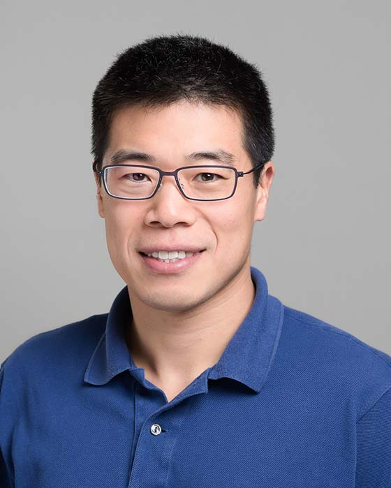

## Ding Yuan

Professor 
Department of Electrical and Computer Engineering 
University of Toronto

E-mail: [yuan@eecg.toronto.edu](mailto:yuan@eecg.toronto.edu) 
Phone: (416) 978-5033 
Office: SF 2002E 
Website: [https://www.eecg.toronto.edu/~yuan/Home.html](https://www.eecg.toronto.edu/~yuan/Home.html)

### Biography

Ding Yuan received the B.E. degree in Computer Science and Engineering and a B.S. degree in Mathematics from Beihang University in 2006, and received the PhD degree in Computer Science from the University of Illinois at Urbana-Champaign (UIUC) in 2012. From 2009 to 2012 he was a visiting student researcher in the Computer Science and Engineering department at the University of California, San Diego. He joined the ECE Department at the University of Toronto as an Assistant Professor in January 2013, became an Associate Professor in 2018, and in 2023 was promoted to Professor. Ding’s research interests are in the general area of software systems with an emphasis on reliability and performance in large system-level software.

### Research Interests

Prof. Yuan's research interest is systems software, with a focus on developing practical solutions to improve the availability and performance of large software systems.

### Honours and Awards

- Vice Chair of ACM SIGOPS (Special Interest Group in Operating Systems), 2023 – present
- Canada Research Chair in Systems Software
- McCharles Prize for Early Career Research Distinction, 2018
- NetApp Faculty Fellowship, 2013, 2016
- Paper in ASPLOS 2011 selected to fast-forward to ACM Transactions on Computer Systems
- ACM SIGSOFT Distinguished Paper Award, 2011
- Outstanding Teaching Assistant, Computer Science Department, UIUC, Spring 2008
- Saburo Muroga Fellowship, UIUC, 2006 – 2007
- University Gold Medal Prize in Beihang University (highest honor), 2005
