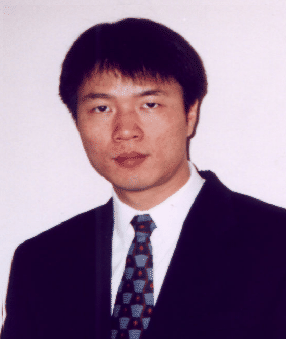

## Jianwen Zhu

Associate Professor 
Department of Electrical and Computer Engineering 
University of Toronto

E-Mail:0 [jzhu@eecg.utoronto.ca](mailto:jzhu@eecg.utoronto.ca) 
Phone: (416) 946-5971 
Office: EA 312 
Website: [https://www.eecg.utoronto.ca/~jzhu/](https://www.eecg.utoronto.ca/~jzhu/)

### Biography

Jianwen Zhu received BE degree in Electrical Engineering from Tsinghua University in 1993, and MS and PhD degrees in Computer Science from University of California, Irvine in 1996 and 1999, respectively. He joined the ECE department of University of Toronto as assistant professor in 2000, where he is now an associate professor. Dr. Zhu’s research interests are in the general area of computer-aided design (CAD) for integrated circuits, with an emphasis on high-level and logic synthesis, and systems-on-chip design and methodology.

### Research Interests

Dr. Zhu’s research interests are in the general area of computer-aided design (CAD) for integrated circuits, with an emphasis on high-level and logic synthesis, and systems-on-chip design and methodology.

### Memberships and Awards

- Member: IEEE, ACM
- Best Paper Awards: ICCD’10, FPGA’10.
